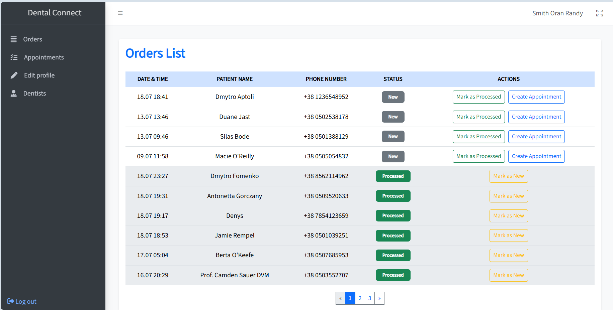
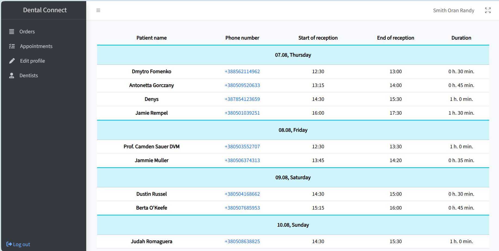

# 🦷 Dental Connect

**Dental Connect** is a web application that allows patients to send appointment requests to doctors, and doctors can view all requests, call patients back, and create appointments at an agreed time.

## 📋 Functionality

### 👤 Patient
- Without registration, leaves an application, choosing a doctor and indicating his phone number.
- Does not see other people's applications or schedule.
- Waiting for the doctor to call back at the specified number.

### 🦷 Dentist
- Logs into the system.
- Receives a list of requests from patients.
- Can create a schedule entry based on the request, specifying the date, start and end of the appointment.
- Sees the patient's name and phone number in the created entry.
- Can view his schedule of appointments.
- Can mark a request as processed or new.
- Can edit his/her profile data.
- Absolutely all data entered by users is validated and in case of an error, a corresponding notification is displayed. When creating appointment records, a check is performed for appointment record collisions.

## 🧠 Architecture: MVC

The project is implemented according to the **Model-View-Controller** pattern.

## 🔧 Technologies

- **PHP 8.4**
- **Laravel 12**
- **Blade** templates
- **MySQL** database
- **Eloquent ORM**
- **Bootstrap 5**
- **JavaScript**

## Application Overview

Image of the patient's home page where they can create a request for a doctor:

You can view all dentists here:

You can view more information about the dentist by clicking on his card:

The dentist can view all appointment requests:

The dentist can click on the appropriate button in the list of requests and proceed to create an appointment:

After creating an appointment, the dentist can navigate to all of their scheduled appointments:

The dentist can also edit his/her profile:

